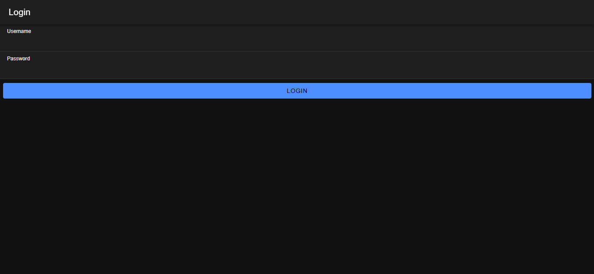
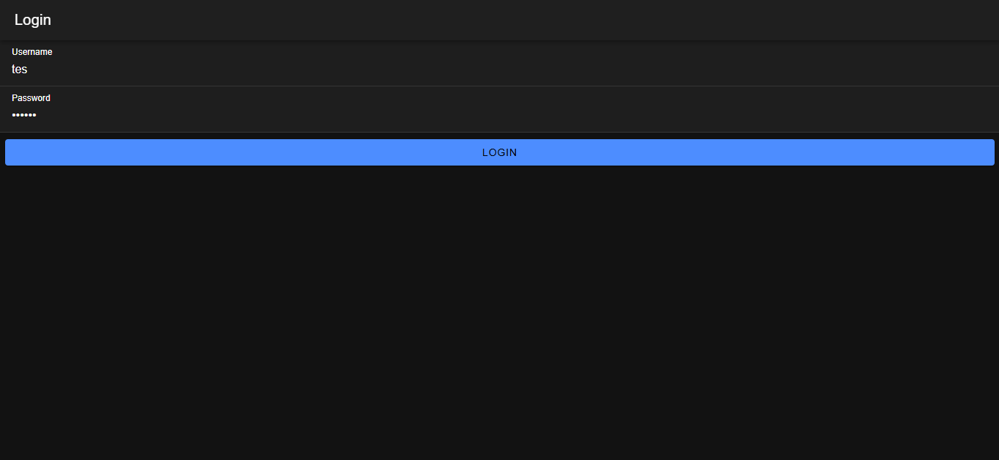
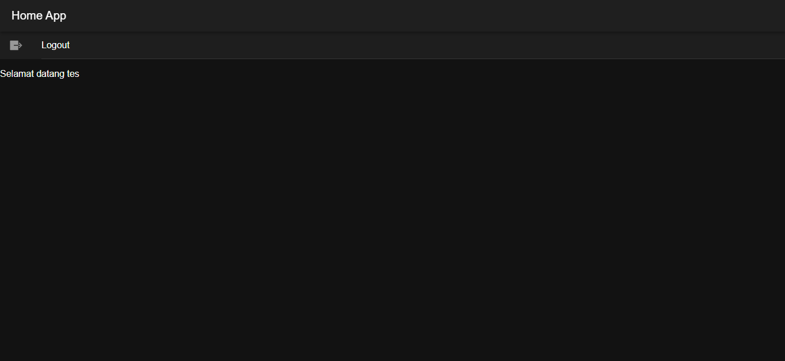

# Cara Kerja Login
1. Input Data Login:
   > Pengguna memasukan username dan password di halaman login.
   
   > Aplikasi mengirimkan data ini ke server lewat API.
2. Verifikasi Login di Server:
   > API di server (file login.php) menerima data login ini.
   
   > Lalu data username dan password dibandingkan dengan data yang ada di database MYSQL (coba-ionic).
   
   > Jika username dan password cocok, API akan mengembalikan status login berhasil dan token autentikasi yang dihasilkan dari timestamp.
3. Menyimpan Data Autentikasi:
   > Ketika login berhasil, token dan username pengguna akan disimpan di perangkat menggunakan Preferences di AuthenticationService.
   
   > Status autentikasi (isAuthenticated) diubah menjadi true, yang menandakan bahwa pengguna sudah login.
4. Menggunakan Guards untuk Mengatur Akses Halaman:
   > Guard authGuard mencegah pengguna yang belum login dari mengakses halaman home dan mengarahkan mereka kembali ke halaman login jika tidak ada autentikasi.
   
   > autoLoginGuard mengarahkan pengguna yang sudah login ke halaman home secara otomatis saat mereka membuka aplikasi, agar mereka tidak melihat halaman login lagi.
5. Mengelola Logout:
   > Jika pengguna memilih logout, aplikasi akan menghapus token dan data pengguna dari Preferences dan mengubah status autentikasi menjadi false.
   
   > Setelah logout pengguna diarahkan kembali ke halaman login.
## Hasna Mumtazah Khairunnisa | H1D022070 | Shift E

